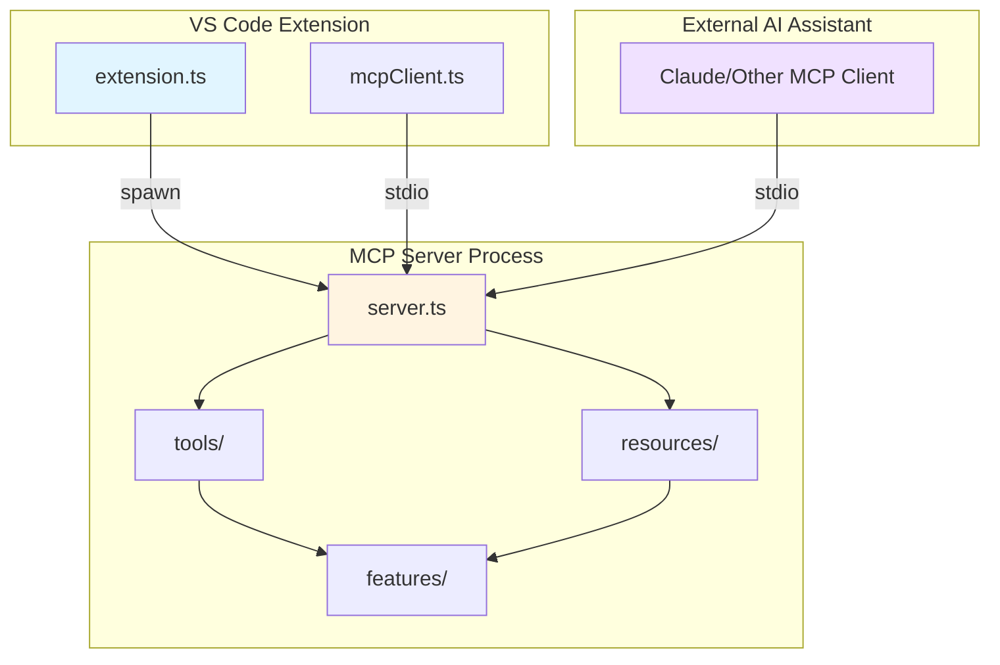
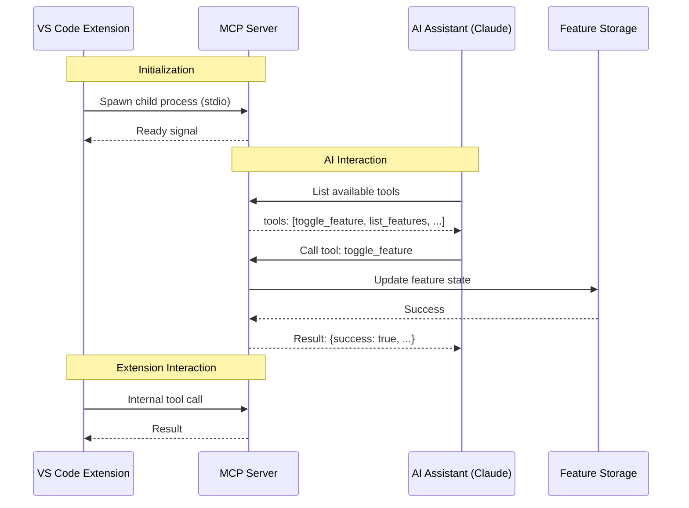

# MCP Integration Architecture for Features Toggle Extension

## Executive Summary

This document outlines the architecture for integrating Model Context Protocol (MCP) into the existing VS Code extension "Features Toggle". The integration will enable AI assistants (like Claude) to interact with feature toggles through a standardized protocol.

---

## 1. MCP Server Type Selection

### Chosen Approach: **TypeScript/Node.js Stdio-based MCP Server**

**Rationale:**
- The extension is already written in TypeScript
- Using the same language ensures type safety and code reuse
- Stdio-based communication is the standard MCP transport mechanism
- Can be bundled with the extension as a separate module

### Alternative Approaches Considered:

| Approach | Pros | Cons | Decision |
|----------|------|------|----------|
| Embedded MCP Server | No separate process, shared memory | Complex to isolate, potential stability issues | ❌ Not chosen |
| Separate Process (Stdio) | Standard MCP pattern, isolated, restartable | Requires process management overhead | ✅ **Chosen** |
| HTTP-based Server | Language-agnostic | Not standard for MCP, requires port management | ❌ Not chosen |

---

## 2. Proposed File Structure

```
features_toggle/
├── src/
│   ├── extension.ts                    # Main VS Code extension entry point
│   ├── mcp/                            # MCP server implementation
│   │   ├── server.ts                   # Main MCP server (entry point)
│   │   ├── index.ts                    # MCP server factory/export
│   │   ├── tools/                      # MCP tools
│   │   │   ├── toggleFeature.ts       # Enable/disable a feature
│   │   │   ├── listFeatures.ts        # List all features
│   │   │   ├── createFeature.ts       # Create a new feature
│   │   │   ├── deleteFeature.ts       # Delete a feature
│   │   │   ├── getFeatureStatus.ts    # Get status of specific feature
│   │   │   └── index.ts               # Tool registry
│   │   ├── resources/                  # MCP resources
│   │   │   ├── featuresConfig.ts      # Full configuration resource
│   │   │   ├── featureDetails.ts      # Individual feature resource
│   │   │   └── index.ts               # Resource registry
│   │   ├── prompts/                    # MCP prompts (optional)
│   │   │   └── index.ts
│   │   └── types.ts                    # Shared type definitions
│   ├── features/                       # Feature toggle business logic
│   │   ├── storage.ts                  # Storage management (workspace/global)
│   │   ├── parser.ts                   # Config file parser (JSON/YAML)
│   │   ├── validator.ts                # Validation utilities
│   │   └── types.ts                    # Feature toggle types
│   └── vscode/                         # VS Code integration
│       ├── commands.ts                 # VS Code command handlers
│       ├── ui.ts                       # UI components (quick pick, etc.)
│       └── mcpClient.ts                # Extension as MCP client
├── dist/                               # Build output
│   ├── extension.js                    # Bundled extension
│   └── mcp/                            # Bundled MCP server
│       └── server.js
├── bin/                                # VSIX packages
├── .vscode/                            # VS Code configuration
├── plans/                              # Architecture and planning docs
├── package.json
├── tsconfig.json
└── esbuild.mjs
```

---

## 3. MCP Tools Specification

### 3.1 Tool: `toggle_feature`

**Purpose:** Enable or disable a specific feature toggle

**Input Schema:**
```json
{
  "type": "object",
  "properties": {
    "featureName": {
      "type": "string",
      "description": "Name of the feature to toggle"
    },
    "enabled": {
      "type": "boolean",
      "description": "True to enable, false to disable"
    }
  },
  "required": ["featureName", "enabled"]
}
```

**Output:**
```json
{
  "success": true,
  "feature": "newDashboard",
  "enabled": true,
  "previousState": false,
  "timestamp": "2024-02-10T19:00:00Z"
}
```

---

### 3.2 Tool: `list_features`

**Purpose:** List all configured feature toggles with their current states

**Input Schema:**
```json
{
  "type": "object",
  "properties": {
    "filter": {
      "type": "string",
      "enum": ["all", "enabled", "disabled"],
      "description": "Filter features by status",
      "default": "all"
    }
  }
}
```

**Output:**
```json
{
  "features": [
    {
      "name": "newDashboard",
      "enabled": true,
      "description": "New dashboard UI",
      "createdAt": "2024-01-15T10:00:00Z"
    },
    {
      "name": "betaAPI",
      "enabled": false,
      "description": "Beta API endpoints",
      "createdAt": "2024-01-20T14:30:00Z"
    }
  ],
  "total": 2,
  "enabledCount": 1,
  "disabledCount": 1
}
```

---

### 3.3 Tool: `create_feature`

**Purpose:** Create a new feature toggle

**Input Schema:**
```json
{
  "type": "object",
  "properties": {
    "name": {
      "type": "string",
      "description": "Unique name for the feature"
    },
    "description": {
      "type": "string",
      "description": "Description of what the feature does"
    },
    "enabled": {
      "type": "boolean",
      "description": "Initial state",
      "default": false
    }
  },
  "required": ["name"]
}
```

**Output:**
```json
{
  "success": true,
  "feature": {
    "name": "darkMode",
    "enabled": false,
    "description": "Dark mode theme",
    "createdAt": "2024-02-10T19:30:00Z"
  }
}
```

---

### 3.4 Tool: `delete_feature`

**Purpose:** Delete a feature toggle

**Input Schema:**
```json
{
  "type": "object",
  "properties": {
    "featureName": {
      "type": "string",
      "description": "Name of the feature to delete"
    }
  },
  "required": ["featureName"]
}
```

**Output:**
```json
{
  "success": true,
  "deletedFeature": "oldFeature",
  "timestamp": "2024-02-10T19:35:00Z"
}
```

---

### 3.5 Tool: `get_feature_status`

**Purpose:** Get detailed status of a specific feature

**Input Schema:**
```json
{
  "type": "object",
  "properties": {
    "featureName": {
      "type": "string",
      "description": "Name of the feature"
    }
  },
  "required": ["featureName"]
}
```

**Output:**
```json
{
  "name": "newDashboard",
  "enabled": true,
  "description": "New dashboard UI",
  "createdAt": "2024-01-15T10:00:00Z",
  "lastModified": "2024-02-10T19:00:00Z",
  "usage": {
    "accessCount": 42,
    "lastAccessed": "2024-02-10T18:45:00Z"
  }
}
```

---

## 4. MCP Resources Specification

### 4.1 Resource: `features://config`

**URI Pattern:** `features://config`

**Purpose:** Provides the complete feature toggle configuration

**MIME Type:** `application/json`

**Output:**
```json
{
  "version": "1.0",
  "features": {
    "newDashboard": {
      "enabled": true,
      "description": "New dashboard UI"
    },
    "betaAPI": {
      "enabled": false,
      "description": "Beta API endpoints"
    }
  },
  "metadata": {
    "lastModified": "2024-02-10T19:00:00Z",
    "totalFeatures": 2
  }
}
```

---

### 4.2 Resource: `features://feature/{name}`

**URI Pattern:** `features://feature/{featureName}`

**Purpose:** Provides details for a specific feature

**MIME Type:** `application/json`

**Output:**
```json
{
  "name": "newDashboard",
  "enabled": true,
  "description": "New dashboard UI",
  "createdAt": "2024-01-15T10:00:00Z",
  "lastModified": "2024-02-10T19:00:00Z"
}
```

---

## 5. MCP Server - VS Code Extension Integration

### 5.1 Communication Architecture



### 5.2 Integration Flow



### 5.3 Process Management

**Startup:**
1. Extension activates → Spawns MCP server as child process
2. Server initializes → Loads feature configuration
3. Server sends "ready" signal via stdio

**Shutdown:**
1. Extension deactivates → Sends shutdown signal to MCP server
2. MCP server saves state → Gracefully terminates
3. Extension kills child process if needed

**Error Recovery:**
- If MCP server crashes → Extension restarts it
- State persisted to disk → No data loss on restart

---

## 6. Data Storage Strategy

### 6.1 Storage Locations

| Type | Location | Scope | Format |
|------|----------|-------|--------|
| Workspace Features | `.vscode/features.json` | Workspace | JSON |
| Global Features | `globalStorageUri/features.json` | User | JSON |
| Temporary State | In-memory | Session | Object |

### 6.2 Configuration File Format

```json
{
  "$schema": "https://features-toggle.dev/schema/v1.json",
  "version": "1.0",
  "features": {
    "featureName": {
      "enabled": true,
      "description": "Feature description",
      "metadata": {}
    }
  }
}
```

---

## 7. Build Configuration Updates

### 7.1 Required Changes to `esbuild.mjs`

```javascript
// Current: Single entry point
entryPoints: ["extension.ts"]

// Proposed: Multiple entry points
entryPoints: [
  "extension.ts",      // VS Code extension
  "src/mcp/server.ts" // MCP server
]
```

### 7.2 Required Changes to `package.json`

```json
{
  "scripts": {
    "build": "node esbuild.mjs",
    "build:mcp": "node esbuild.mjs --mcp-only",
    "watch": "node esbuild.mjs --watch"
  },
  "dependencies": {
    "@modelcontextprotocol/sdk": "^1.0.0"
  }
}
```

---

## 8. Type Definitions

### 8.1 Core Types (src/mcp/types.ts)

```typescript
export interface Feature {
  name: string;
  enabled: boolean;
  description?: string;
  createdAt: string;
  lastModified?: string;
  metadata?: Record<string, unknown>;
}

export interface FeatureConfig {
  version: string;
  features: Record<string, Feature>;
  metadata?: {
    lastModified?: string;
    totalFeatures?: number;
  };
}

export interface ToolResult<T = unknown> {
  success: boolean;
  data?: T;
  error?: string;
  timestamp: string;
}
```

---

## 9. Security Considerations

1. **Input Validation:** All tool inputs must be validated before processing
2. **Path Traversal Prevention:** Sanitize feature names to prevent file system attacks
3. **Permission Checks:** Verify workspace write permissions before modifications
4. **Rate Limiting:** Consider rate limiting for MCP tool calls
5. **Sensitive Data:** Avoid exposing workspace secrets through MCP resources

---

## 10. Testing Strategy

### 10.1 Unit Tests
- Tool implementations
- Resource handlers
- Feature storage logic
- Validation utilities

### 10.2 Integration Tests
- MCP server startup/shutdown
- Tool execution via stdio
- Resource retrieval
- Extension ↔ MCP communication

### 10.3 End-to-End Tests
- Full workflow with AI assistant
- VS Code command execution
- Configuration persistence

---

## 11. Implementation Phases

### Phase 1: Core MCP Server
- [ ] Set up MCP SDK dependencies
- [ ] Create basic MCP server structure
- [ ] Implement stdio communication
- [ ] Add tool registration framework

### Phase 2: Feature Toggle Logic
- [ ] Implement storage layer
- [ ] Create feature CRUD operations
- [ ] Add validation utilities

### Phase 3: MCP Tools
- [ ] Implement `toggle_feature` tool
- [ ] Implement `list_features` tool
- [ ] Implement `create_feature` tool
- [ ] Implement `delete_feature` tool
- [ ] Implement `get_feature_status` tool

### Phase 4: MCP Resources
- [ ] Implement `features://config` resource
- [ ] Implement `features://feature/{name}` resource

### Phase 5: VS Code Integration
- [ ] Update extension to spawn MCP server
- [ ] Add process management
- [ ] Implement error handling
- [ ] Add VS Code commands that use MCP

### Phase 6: Build & Configuration
- [ ] Update esbuild configuration
- [ ] Update package.json
- [ ] Add TypeScript configuration for MCP

### Phase 7: Testing & Documentation
- [ ] Write unit tests
- [ ] Write integration tests
- [ ] Create user documentation
- [ ] Create developer documentation

---

## 12. Dependencies to Add

```json
{
  "dependencies": {
    "@modelcontextprotocol/sdk": "^1.0.0"
  },
  "devDependencies": {
    "@types/node": "^20.x",
    "@types/vscode": "^1.84.0"
  }
}
```

---

## 13. Summary

This architecture provides a comprehensive plan for integrating MCP into the Features Toggle VS Code extension:

1. **TypeScript/Node.js MCP server** using stdio for communication
2. **5 tools** for managing feature toggles (toggle, list, create, delete, get status)
3. **2 resources** for accessing feature configuration
4. **Separate process architecture** for isolation and stability
5. **Workspace and global storage** for configuration persistence
6. **Phased implementation** for incremental development

The design allows the extension to be used both directly by VS Code users and by AI assistants through the MCP protocol, enabling powerful automation and natural language interactions with feature toggles.
